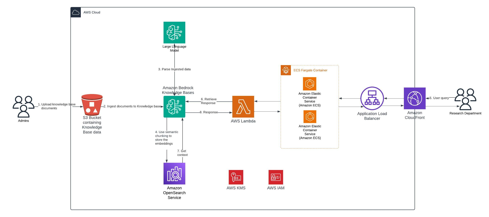

# Advanced RAG Assistant

This solution demonstrates a comprehensive implementation of an advanced Generative AI Assistant using [Amazon Bedrock Knowledge Bases](https://aws.amazon.com/bedrock/knowledge-bases/). The system enables foundation models and agents to leverage contextual information from private data sources, delivering highly relevant and customized responses. Notable features include advanced processing of complex graphs, images, and tables from documents, with automated deployment via AWS CloudFormation. Ideal for research, customer service, HR assistance, and various enterprise applications.

## Tech Stack

- **Amazon Bedrock Knowledge Bases**: Core RAG functionality
- **Amazon OpenSearch Serverless**: Vector database
- **Amazon S3**: Document storage
- **AWS Lambda**: API integration with Bedrock Knowledge Base

## Prerequisites

- Before you can use a foundation model in Amazon Bedrock. Follow [this documentation](https://docs.aws.amazon.com/bedrock/latest/userguide/model-access-modify.html) to request acccess for below models.
    * Claude 3 Sonnet
    * Titan Text Embeddings V2
 
## Architecture


## Solution Description
When ingesting your data, Amazon Bedrock Knowledge Bases first splits your documents or content into manageable chunks for efficient data retrieval. The chunks are then converted to embeddings and written to a vector index (vector representation of the data), while maintaining a mapping to the original document. The vector embeddings allow the texts to be quantitatively compared.
This solution utilizes [advanced parsing and chunking features](https://community.aws/content/2jU5zpqh4cal0Lm47MBdRmKLLJ5/a-developer-s-guide-to-advanced-chunking-and-parsing-with-amazon-bedrock?lang=en) of Amazon Bedrock Knowledge Bases. In addition to default and fixed size chunking, Knowledge bases has introduced semantic chunking and hierarchical chunking. If your document may benefit from inherent relationships within your document, it may be wise to use hierarchical chunking allowing for more granular and efficient retrieval. Some documents benefit from semantic chunking by preserving the contextual relationship in the chunks helping to ensure that the related information stays together in logical chunks.
The solution uses streamlit application as the front end for providing the chatbot interface. The streamlit application is making a call to [AWS Lambda](https://aws.amazon.com/lambda/) function which in turn calls Amazon Bedrock Knowledge Bases [RetrieveAndGenerate](https://docs.aws.amazon.com/bedrock/latest/APIReference/API_agent-runtime_RetrieveAndGenerate.html) API to get answer to the user's query.


## Deployment Guide

### Create an Amazon S3 Bucket and Upload Source Code

1. Open [AWS CloudShell](https://console.aws.amazon.com/cloudshell/).
2. Clone the Git Repository and zip the source code

    ```bash
    git clone <CLONE_URL>
    cd samples-for-agentic-rag/advanced-rag-assistant-with-hosted-streamlit-app/
    zip -r ../advanced-rag-assistant-with-hosted-streamlit-app.zip ./* && cd ..
    ```
3. Create an Amazon S3 bucket and upload source code as a zip file

    ```bash
    export AWS_ACCOUNT_ID=$(aws sts get-caller-identity --query 'Account' --output text)
    if [ "$AWS_REGION" = "us-east-1" ]; then
        aws s3api create-bucket \
            --bucket "codebuild-s3-source-$AWS_ACCOUNT_ID" \
            --region "$AWS_REGION"
    else
        aws s3api create-bucket \
            --bucket "codebuild-s3-source-$AWS_ACCOUNT_ID" \
            --region "$AWS_REGION" \
            --create-bucket-configuration "LocationConstraint=$AWS_REGION"
    fi
    aws s3 cp advanced-rag-assistant-with-hosted-streamlit-app.zip s3://codebuild-s3-source-$AWS_ACCOUNT_ID
    ```

### Prepare and Deploy AWS CloudFormation Template

1. Run `deploy.sh` to create AWS CloudFormation Template.

    ```bash
    bash deploy.sh  # Default bucket name: e2e-rag-deployment-${ACCOUNT_ID}-${AWS_REGION}
    ``` 

    After completion, copy the `main-template-out.yml` S3 URL for the next step.

2. Deploy AWS CloudFormation Stack

    * Navigate to [AWS CloudFormation Console](https://console.aws.amazon.com/cloudformation/) and click `Create stack -> With new resources (Standard)`
    * Select "Template source" as Amazon S3 URL
    * Paste the S3 URL from Step 1
    * Provide a Stack name
    * Deploy stack
    * Wait for the stack status to show "CREATE_COMPLETE". Deployment typically takes 7-10 minutes.
    * From the outputs Tab, copy S3 Bucket Name from `KnowledgeBaseS3BucketName`.


### Upload Source Files

1. Open [Amazon S3](https://console.aws.amazon.com/s3/) and search for the KnowledgeBase S3 Bucket name copied from previous step.
2. Upload your source files.

### Sync Knowledge Base

1. Access [Amazon Bedrock Console](https://console.aws.amazon.com/bedrock/)
2. Click on `Knowledge Bases` in the navigation menu
3. Click on the newly created Knowledge Base.
4. Under Data Sources, select `Amazon S3 Source` and click on `Sync`.
4. Wait for the sync to finish.


### Create Amazon CodeBuild Project to deploy Streamlit Application on Amazon ECS

1. Create an AWS IAM Service Role for AWS CodeBuild

    Observe that the same IAM policy attached to logged in user role is attached to CodeBuild's Service Role as well.

    ```bash
    cat << 'EOF' > codebuild-trust-policy.json
    {
    "Version": "2012-10-17",
    "Statement": [
        {
        "Effect": "Allow",
        "Principal": {
            "Service": "codebuild.amazonaws.com"
        },
        "Action": "sts:AssumeRole"
        }
    ]
    }
    EOF

    aws iam create-role --role-name CodeBuildServiceRole-$AWS_REGION --assume-role-policy-document file://codebuild-trust-policy.json

    aws iam attach-role-policy --role-name CodeBuildServiceRole-$AWS_REGION --policy-arn $(aws iam list-attached-role-policies --role-name $(aws sts get-caller-identity --query 'Arn' --output text | cut -d'/' -f2) --query 'AttachedPolicies[0].PolicyArn' --output text)
    ```

2. Create an AWS CodeBuild project using Amazon S3 as source and start building the project

    ```bash
    export AWS_ACCOUNT_ID=$(aws sts get-caller-identity --query 'Account' --output text)
    aws codebuild create-project \
    --name "advanced-rag-assistant-with-hosted-streamlit-app" \
    --source "{
        \"type\": \"S3\",
        \"location\": \"codebuild-s3-source-$AWS_ACCOUNT_ID/advanced-rag-assistant-with-hosted-streamlit-app.zip\",
        \"buildspec\": \"buildspec.yml\"
    }" \
    --artifacts "{
        \"type\": \"NO_ARTIFACTS\"
    }" \
    --environment "{
        \"type\": \"LINUX_CONTAINER\",
        \"image\": \"aws/codebuild/amazonlinux2-x86_64-standard:5.0\",
        \"computeType\": \"BUILD_GENERAL1_SMALL\",
        \"privilegedMode\": true
    }" \
    --service-role $(aws iam get-role --role-name CodeBuildServiceRole-$AWS_REGION --query 'Role.Arn' --output text)

    aws codebuild start-build --project-name "advanced-rag-assistant-with-hosted-streamlit-app"
    ```

Navigate to [AWS CodeBuild](https://console.aws.amazon.com/codesuite/codebuild/projects) to see the logs.

**If this is your first time deploying it, the process may take approximately 15-20 minutes.**

Once the deployment process is complete, you will see the Amazon CloudFront URL for the hosted Streamlit Application. Click on the link to access the application.


The chatbot interface will open in your default browser, ready for natural language interactions.

## Cleanup

1. Open [Amazon S3](https://console.aws.amazon.com/s3/),  select `kbsuppmultimodalbucket` bucket and click on **Empty** bucket. Repeat the process for `e2e-rag-deployment-XXXX`,  `knowledgebases3bucket` and `codebuild-s3-source-xxxx` buckets.
2. Delete `e2e-rag-deployment-XXXX` and `codebuild-s3-source-xxxx` once they are empty. The other two buckets will be deleted by AWS CloudFormation.
3.  Open [AWS CloudFormation](https://console.aws.amazon.com/cloudformation/), delete `StreamlitServerlessApp-FrontendStack` and `Your RAG Assistant Stack`.
4. Open [Amazon CodeBuild](https://console.aws.amazon.com/codesuite/codebuild/projects), delete `advanced-rag-assistant-with-hosted-streamlit-app` project.

## Contributing

We welcome community contributions! Please see [CONTRIBUTING.md](../CONTRIBUTING.md) for guidelines.